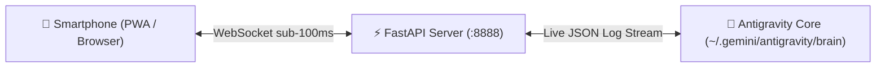

# 🚀 Antigravity WebRemote

<div align="center">

**A lightweight, real-time web & mobile remote client for Google Antigravity.**  
*Mirroring conversations, live thinking/tool status, artifacts, and two-way chat directly from your smartphone.*

[](LICENSE)
[](https://www.python.org/)
[](https://fastapi.tiangolo.com/)
[](https://tailscale.com/)

</div>

---

## ✨ Features

- 📱 **1:1 Antigravity Desktop Clone**: Dark Obsidian UI matching the exact desktop interface with full project tree, active session breadcrumbs, and right panel overview.
- ⚡ **Real-Time WebSocket Live Stream**: Sub-100ms streaming of agent responses, terminal outputs, and file modifications.
- 🧠 **Live Engine Status & Thinking Badge**: Animated pulsing badge displaying real-time agent status (`Idle` vs `Working`), live timer (`Worked for Xs`), and current executing tool actions.
- 💬 **Two-Way Interactive Chat**: Send prompts, select workflows (`/goal`, `/schedule`), or dictate voice prompts (Speech-to-Text) from your phone directly into Antigravity.
- 📖 **Artifact & Document Modal Viewer**: Click any artifact markdown or code file from the right panel to read it inside a popup viewer.
- 🌐 **Zero-Config Networking**:
  - **Local Wi-Fi (mDNS)**: Access via `http://wahyuai.local:8888`.
  - **Remote Anywhere (Tailscale)**: Access seamlessly over your secure Tailscale mesh VPN.
- 🤫 **Background Resilient**: Runs quietly as a detached background service on Windows/Linux/macOS without holding or blocking active agent sessions.

---

## 🏗️ Architecture



---

## 🚀 Quick Start

### 1. Clone Repository
```bash
git clone https://github.com/triwahyu45/Antigravity_WebRemote.git
cd Antigravity_WebRemote
```

### 2. Install Dependencies
```bash
pip install -r requirements.txt
```

### 3. Configure
Copy the example configuration:
```bash
cp config.example.json config.json
```

### 4. Run Server
```bash
python server.py
```

Open on your phone:
- **Local Wi-Fi**: `http://wahyuai.local:8888`
- **Tailscale**: `http://<your-tailscale-ip>:8888`

---

## 🛠️ Tech Stack

- **Backend**: FastAPI, Uvicorn, WebSockets, Zeroconf (mDNS), psutil
- **Frontend**: Vanilla JS (PWA Ready), HTML5, CSS3 (Glassmorphism), Marked.js, Highlight.js
- **Network**: mDNS / Bonjour, Tailscale VPN

---

## 📄 License

This project is licensed under the [MIT License](LICENSE).

---
<div align="center">
Built with ❤️ for Google Antigravity
</div>

---

## 💖 Support & Donations

If you find this project helpful or inspiring, consider supporting its maintenance and further development!

[-2563eb?style=for-the-badge&logo=cashapp&logoColor=white)](https://sociabuzz.com/triwahyu45)
[](https://saweria.co/triwahyu45)
[](https://trakteer.id/triwahyu45)
